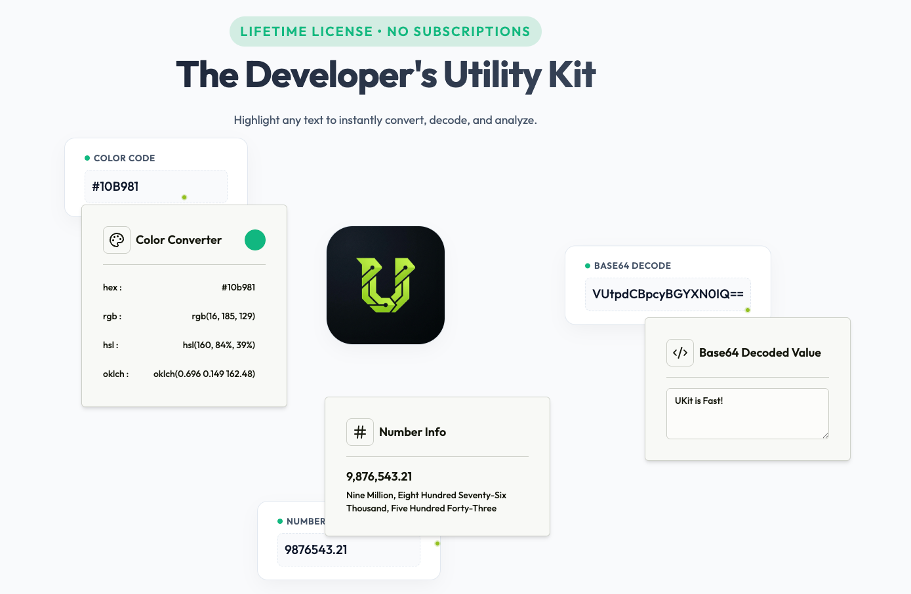

# ukit - The Ultimate Developer Utility Extension

**ukit** is a powerful, all-in-one browser extension designed to streamline your daily development workflow. It provides a suite of essential utilities accessible right from your browser toolbar, helping you convert, calculate, and analyze data without switching context.

## 🚀 Getting Started

### Installation
(Add installation link here once published to Chrome/Firefox/Edge stores)

### How to Trigger
**ukit** is designed to be unobtrusive and context-aware. To trigger the extension, simply **select text** on any webpage.

If the selected text matches one of the supported categories (Number, Color, Text Paragraph, Encoded URI, Base64 String, or Timestamp), the **ukit** icon will appear. Click the icon to open the popover and access the relevant utilities.

## 🛠️ Features & Categories

ukit organizes its utilities into smart "Popovers" that activate based on your input. Here are the supported categories and inputs:

### 1. 🎨 Color Converter
Instantly convert color formats.
-   **Supported Inputs**: Hex codes (e.g., `#000000`), RGB values (e.g., `rgb(0, 0, 0)`), and other valid color strings.
-   **Outputs**:
    -   Hex
    -   RGB
    -   **HSL** (Pro)
    -   **OKLCH** (Pro)

### 2. 📝 Text Analysis
Analyze text content for readability and metrics.
-   **Supported Inputs**: Any text block with **7 or more words**.
-   **Outputs**:
    -   Word Count
    -   Character Count
    -   Estimated Reading Time
    -   Flesch Reading Ease
    -   **Flesch-Kincaid Grade** (Pro)
    -   **Gunning Fog Index** (Pro)
    -   **SMOG Index** (Pro)
    -   **Coleman-Liau Index** (Pro)

### 3. 📅 Date & Time
Parse and format dates and timestamps.
-   **Supported Inputs**: ISO strings, timestamps, and standard date formats.
-   **Outputs**:
    -   Local Date & Time
    -   Relative Time (e.g., "2 hours ago")
    -   Timezone Information

### 4. 🔢 Number Tools
Format and convert numbers.
-   **Supported Inputs**: Integer and decimal numbers.
-   **Outputs**:
    -   Formatted Number (with locale separators)
    -   Number to Words (e.g., "one hundred twenty-three")

### 5. 🔗 URI Decoder
Decode complex URLs.
-   **Supported Inputs**: Percent-encoded URIs (e.g., `https%3A%2F%2Fexample.com`).
-   **Outputs**:
    -   Fully decoded URI string.

### 6. 💻 Base64 Decoder
Decode Base64 strings.
-   **Supported Inputs**: Valid Base64 encoded strings.
-   **Outputs**:
    -   Decoded plain text.

---

## 💎 Free vs Pro

ukit is available for free with essential features. Upgrade to **Pro** for advanced metrics and formats.

| Feature Category | Free | Pro |
| :--- | :--- | :--- |
| **Color** | Hex, RGB | **+ HSL, OKLCH** |
| **Text Analysis** | Word/Char Count, Reading Time, Flesch Ease | **+ Flesch-Kincaid, Gunning Fog, SMOG, Coleman-Liau** |
| **Date & Time** | Local, Relative, Timezone | **+ Week Number, Day of Year** |
| **Number Tools** | All Features | All Features |
| **URI & Base64** | All Features | All Features |

### 🔑 License & Pricing
-   **One-Time Payment**: Pay once, own it forever. No recurring subscriptions.
-   **Free Updates**: Your license includes all future updates and new features at no extra cost.

## 🆘 Support & Issues

This repository (`ukit-docs`) is the official hub for documentation and issue tracking.

-   **Found a bug?** [Create an issue](https://github.com/AnkurSaini07/ukit-docs/issues)
-   **Have a feature request?** [Start a discussion](https://github.com/AnkurSaini07/ukit-docs/discussions) or open a ticket.

---
*Built with ❤️ for developers.*
